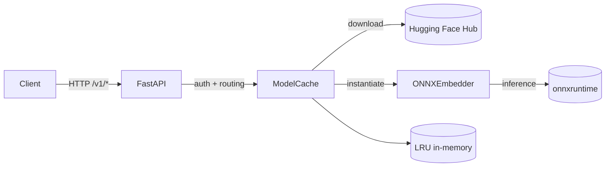

# Zephyr — fast, pure-ONNX embeddings server

Zephyr delivers OpenAI-compatible embedding and model endpoints without the weight of PyTorch. It downloads ONNX models from Hugging Face, serves them via FastAPI, and runs on GPU or CPU with optional quantization—ideal when you want small, fast, and container-friendly inference.

## Why you’ll like it (quick pitch)
- **OpenAI-compatible surface:** `/v1/embeddings`, `/v1/models`, retrieve, and delete endpoints; Bearer auth mirrors OpenAI keys.
- **Zero PyTorch bloat:** pure ONNX Runtime, slim container, quick cold starts.
- **Pluggable performance:** switch GPU/CPU per model; opt-in quantization for tight footprints.
- **Smart caching:** configurable LRU of loaded models plus preload list for warm starts.
- **DX-minded:** tiny dependency set, pytest suite, and straightforward config via `config/config.yaml`.

## Short overview
- FastAPI app boots with a `ModelCache` that preloads any models listed in `preload`.
- Requests authenticate via `Authorization: Bearer <OPENAI_API_KEY>`.
- On-demand loads pull `model.onnx` + tokenizer from Hugging Face Hub, optionally quantize, then serve through ONNX Runtime.
- LRU cache manages memory and tracks per-model `created` timestamps; delete endpoint unloads models.

## Architecture (mermaid)

## Run it
1) `export OPENAI_API_KEY=your_key`
2) `uvicorn server.main:app --reload` (or use the Dockerfile)

Key configs live in `config/config.yaml`—set per-model `repo`, `device`, `quantize`, and `owner`; adjust `cache` and `preload` to fit your deployment. 

## Contributing
- Fork the repo and work on a branch in your fork.
- Open a pull request to `main`; CI will run and we review/merge.
- Direct pushes to `main` are reserved for the repo owner; force-push and branch deletion are disabled.
