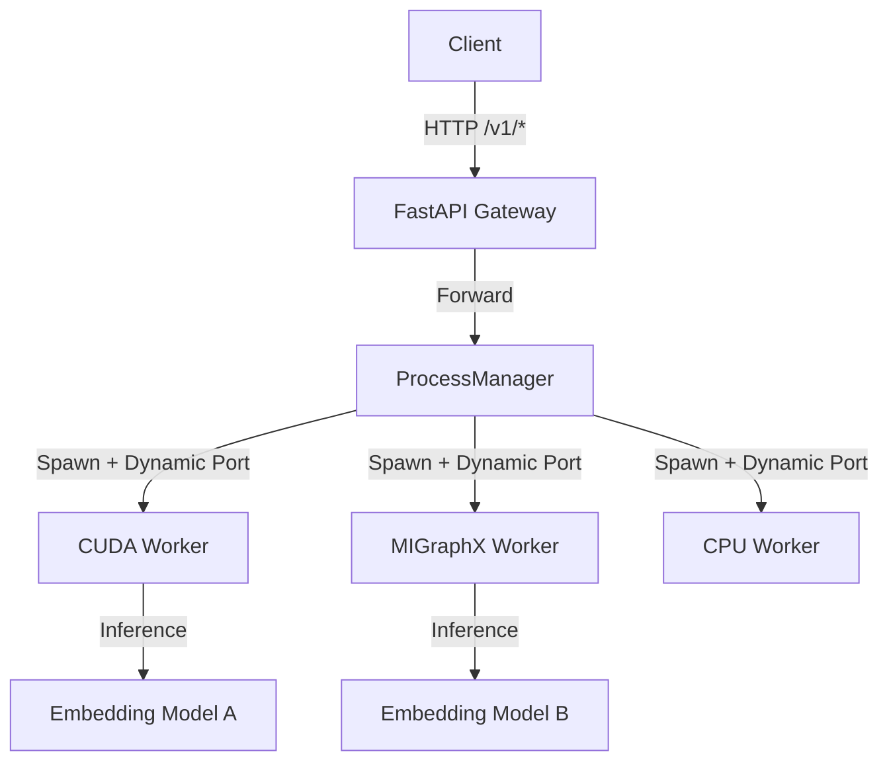

# Zephyr — High-Performance ONNX Embedding Server

Zephyr is a lightweight, OpenAI-compatible server for text embeddings. Built on **ONNX Runtime**, it provides fast, efficient inference on both GPU (CUDA, ROCm) and CPU without the overhead of full Deep Learning frameworks. It manages isolated worker processes to handle conflicting driver dependencies seamlessly.

## Key Features
- **OpenAI-Compatible API:** Drop-in replacement for `/v1/embeddings`, supporting standard Bearer authentication.
- **Pure ONNX Runtime:** Efficient inference with optimized kernels for varied hardware.
- **Process Isolation:** Runs models in separate processes to support mixed backends (e.g., CUDA and MIGraphX) simultaneously.
- **Dynamic Resource Management:** Automatically allocates ports and manages worker lifecycles.
- **Flexible Deployment:** Switch between GPU and CPU per model, with optional quantization for reduced memory usage.
- **Smart Caching:** LRU eviction policy to manage loaded models within memory limits.

## Architecture

Zephyr employs a **Process Manager** to isolate execution environments. This allows the server to support conflicting library requirements (like different Python versions or incompatible shared libraries for AMD vs. NVIDIA drivers) on the same host.


```mermaid
flowchart TD
    Client -->|HTTP /v1/*| Gateway[FastAPI Gateway]
    Gateway -->|Forward| ProcessManager
    ProcessManager -->|Spawn + Dynamic Port| WorkerA[CUDA Worker]
    ProcessManager -->|Spawn + Dynamic Port| WorkerB[MIGraphX Worker]
    ProcessManager -->|Spawn + Dynamic Port| WorkerC[CPU Worker]
    
    WorkerA -->|Inference| Model1[Embedding Model A]
    WorkerB -->|Inference| Model2[Embedding Model B]
```

## Installation

Zephyr includes a setup script to create the necessary isolated virtual environments (`.venv-cpu`, `.venv-cuda`, `.venv-migraphx`).

1. **Install Dependencies:**
   ```bash
   ./install.sh
   # Creates virtual environments and installs dependencies per backend
   ```

2. **Configure Models:**
   Edit `config/config.yaml` to define your models and their assigned engines.
   ```yaml
   models:
     bge-small-en-v1.5:
       repo: "Xenova/bge-small-en-v1.5"
       engine: "migraphx"  # Options: "cuda", "migraphx", "cpu"
       quantize: false
   ```

3. **Run the Server:**
   Start the gateway. It will automatically bind to `0.0.0.0` for external access.
   ```bash
   export OPENAI_API_KEY=your_key
   ./run.sh
   ```

   The server will listen on port `8080`.

## Configuration
All settings are managed in `config/config.yaml`:
- `cache`: Control `max_loaded_models` and cache directory.
- `models`: Define model repositories, engines, and batch sizes.
- `preload`: List models to load on startup.

## Contributing
- Fork the repository.
- Submit a Pull Request to `main`.
